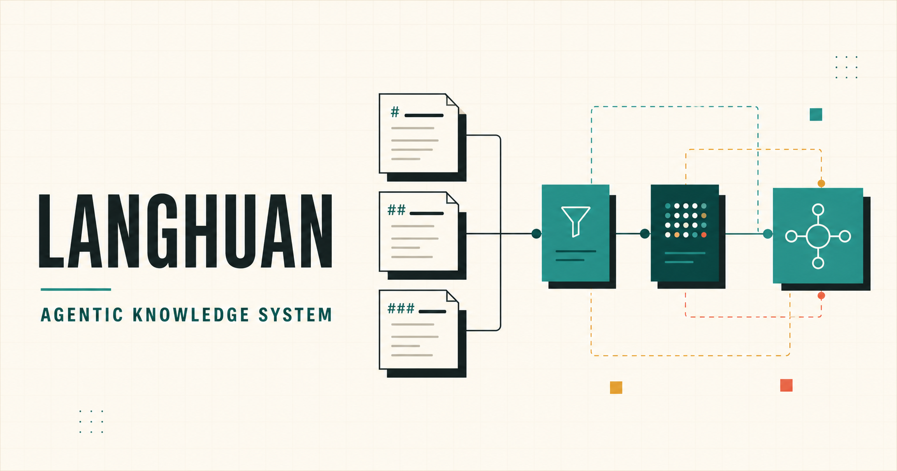
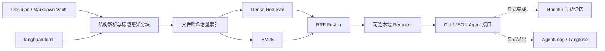

# Langhuan（琅嬛）

**面向 Obsidian / Markdown 项目的本地优先 Agent 知识基础设施。**

Langhuan 把结构化笔记转成可增量维护、可限定项目范围、可供不同 Agent 调用的检索上下文。核心 RAG 不依赖云服务；长期记忆与可观测平台是可选边界，而不是运行前提。



[打开交互式项目总览](https://farprt.github.io/langhuan-agentic-knowledge-system/)

> 当前为 `0.1.0-alpha`：核心检索可以运行，公开基准指标仍待在固定数据集上实测。`ask` 返回检索证据，不伪装成完整问答 Agent。

## 已实现

- 解析 frontmatter、`[[wikilink]]`、`![[embed]]` 与 Markdown 标题层级；
- heading-aware chunking，为知识块保留来源与标题上下文；
- 文件 SHA-256 驱动的增量同步、删除检测、原子写入与一致性审计；
- Dense Retrieval、BM25 与 Reciprocal Rank Fusion（RRF）混合召回；
- 零依赖 Hash Embedding 离线演示，以及显式加载本地 BGE / Cross-Encoder 的接口；
- 通过 `scope` 将检索限制在阅读、项目或用户自定义路径；
- 默认仅写本地 JSONL 元数据，查询正文与摘要采集关闭。

## 架构



核心只负责“把相关、可追溯的证据交给 Agent”。Agent 决策、长期记忆与 Trace 分属不同生命周期，避免一个不可用的外部服务拖垮本地检索。

## 五分钟上手

要求 Python 3.11 或更高版本。

```powershell
py -3.11 -m venv .venv
.\.venv\Scripts\Activate.ps1
python -m pip install -e .

# 不读取用户文件、不联网的自检
langhuan demo

# 接入自己的 Obsidian / Markdown 库
langhuan init --vault "D:\Notes\MyVault"
langhuan doctor
langhuan index
langhuan ask "这个知识库如何组织项目文档？"
```

增量更新与机器可读输出：

```powershell
langhuan sync
langhuan ask "RAG 的隐私边界是什么？" --scope projects --json
```

也可以直接体验仓库内的公开演示库：

```powershell
Copy-Item langhuan.toml.example langhuan.toml
langhuan index
langhuan ask "什么比一条固定 prompt 更值得沉淀？"
```

## 单一配置接口

`langhuan init` 生成不进入 Git 的 `langhuan.toml`。最常调整的是目录边界和项目 scope：

```toml
[vault]
path = "D:/Notes/MyVault"
include = ["Sources", "Concepts", "Projects", "Maps", "Areas", "Home"] # 或 ["."]
exclude = [".git", ".obsidian", ".langhuan", "Assets", "Inbox/Processing"]

[retrieval]
embedding_model = "hash"
reranker_model = ""

[scopes.job_hunting]
paths = ["Projects/Job Hunting", "Sources/Workbooks"]

[observability]
enabled = true
include_content = false
```

配置文件只负责结构与本地路径。API Key、LicenseKey 等凭据必须从环境变量或操作系统密钥存储传入集成层，不能写入 TOML。

## 使用本地语义模型

默认 `hash` 后端用于完全离线的安装验证和小型知识库。需要 BGE-M3 或 Cross-Encoder 时：

```powershell
python -m pip install -e ".[models]"
```

显式下载模型到本机后，将其**本地目录**写入配置：

```toml
[retrieval]
embedding_model = "D:/models/bge-m3"
reranker_model = "D:/models/bge-reranker-v2-m3"
```

Langhuan 不会隐式访问 Hugging Face。这样可以区分“安装或更新模型”与“日常离线检索”，也能避免一次网络波动改变运行结果。

## 隐私和可恢复性

- `.langhuan/index.json` 包含知识块正文与向量，只能视为原知识库的敏感派生物；
- `events.jsonl` 默认保存事件类型、数量与查询长度，不保存查询正文或可用于关联查询的固定摘要；
- 索引、日志、模型、真实配置和常见凭据格式均由 `.gitignore` 排除；
- 写索引使用临时文件替换，完整写入前不会覆盖上一个可用版本；
- AgentLoop、Langfuse 与 Honcho 都不随核心自动启动或自动上报。

公开仓库发布前仍应运行秘密扫描与大文件检查。完整威胁边界见 [SECURITY.md](SECURITY.md)。

## 可选集成

| 集成 | 职责 | 核心不可用时 |
|---|---|---|
| Honcho | 跨会话稳定结论与用户偏好 | RAG 继续工作，不写长期记忆 |
| AgentLoop / LoongSuite | Agent 与 RAG Trace 分析 | 事件保留本地，不阻塞查询 |
| Langfuse | 可替换的 Trace、Dataset 与评估出口 | 事件保留本地，不阻塞查询 |

仓库只提供去敏后的边界文档和配置约定，绝不重新发布第三方平台源码。见 [`integrations/`](integrations/README.md)。

## 与知识库仓库的关系

- `Obsidian_Notes_Workspace`：公开参考知识库与实施文档；
- `langhuan-agentic-knowledge-system`：可以安装并接入任意相似 Markdown 项目的运行引擎；
- 作者的私有知识库：真实长期生产案例，不作为公开仓库的数据依赖。

公开参考库演示一种组织方式，但 Langhuan 只依赖配置中的目录和 frontmatter 约定，并不绑定作者的私人路径。

## 待实测指标

以下项目不会在没有固定数据集和脚本证据时填写数字：

- Recall@5、MRR、nDCG；
- Dense、BM25、RRF 与 Reranker 的消融结果；
- 首次索引和单文件增量同步耗时；
- p50 / p95 查询延迟与峰值内存；
- 中断恢复及索引一致性测试。

## 开发验证

```powershell
$env:PYTHONPATH = "$PWD\src"
python -m unittest discover -s tests -v
python -m langhuan demo
```

设计决策和首版限制见 [`docs/ARCHITECTURE.md`](docs/ARCHITECTURE.md)。

## 交互展示

[`showcase/`](showcase/README.md) 提供面向首次访问者的交互式 HTML 总览。它只展示当前公开代码可验证的能力，Markdown、tests 和版本历史仍是事实源。

## License

原创代码使用 [Apache License 2.0](LICENSE)。第三方软件与模型不随本仓库重新分发，分别遵循其上游许可证，详见 [THIRD_PARTY_NOTICES.md](THIRD_PARTY_NOTICES.md)。
