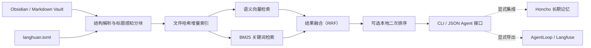

# Langhuan（琅嬛）

**面向 Obsidian / Markdown 项目的本地优先 Agent 知识库工具。**

Langhuan 让 Agent 能够检索笔记正文、定位已有文件，并在修改前取得这次任务需要阅读的文件和检查项。核心功能可完全离线运行；长期记忆和云端分析都是可选集成。


[打开交互式项目总览](https://farprt.github.io/langhuan-agentic-knowledge-system/)

> 当前为 `0.2.0`（Alpha）：检索、结构定位和本地运行记录均可独立使用。公开基准指标仍待在固定数据集上实测；`ask` 只返回检索证据，不伪装成完整问答 Agent。

## 已实现

- 解析 YAML 元数据、`[[wikilink]]`、`![[embed]]` 与 Markdown 标题层级；
- 按标题结构分块，并为每个知识片段保留来源与上级标题；
- 文件 SHA-256 驱动的增量同步、删除检测、原子写入与一致性审计；
- 组合语义向量检索、BM25 关键词检索和倒数排名融合（RRF），并可用本地交叉编码器二次排序；
- 提供零依赖的离线演示，也可以显式加载本地 BGE 模型；
- 通过 `scope` 把检索限制在指定项目或目录；
- 生成不含笔记正文的结构索引，帮助 Agent 精确定位文件；
- 为单个目标生成小型任务上下文包，列出应阅读文件和必须执行的检查；
- 默认只在本地记录运行元数据，并可显式导出到 AgentLoop 或 Langfuse。

## 架构


```mermaid
flowchart LR
    V["Obsidian / Markdown Vault"] --> P["结构解析与标题感知分块"]
    C["langhuan.toml"] --> P
    P --> I["文件哈希增量索引"]
    I --> D["语义向量检索"]
    I --> B["BM25 关键词检索"]
    D --> R["结果融合（RRF）"]
    B --> R
    R --> X["可选本地二次排序"]
    X --> A["CLI / JSON Agent 接口"]
    A -.显式集成.-> H["Honcho 长期记忆"]
    A -.显式导出.-> O["AgentLoop / Langfuse"]
```

核心只负责“把相关、可追溯的证据交给 Agent”。Agent 决策、长期记忆与运行分析互不依赖，外部服务不可用时不会拖垮本地检索。

## 四个核心对象

| 普通名称 | 代码中的名称 | 实际作用 |
|---|---|---|
| 正文检索 | RAG | 从笔记正文中找出与问题相关的片段。 |
| 结构索引 | Catalog | 记录文件路径、标题、别名和显式链接，不保存正文。 |
| 任务上下文包 | Task Envelope | 针对一个目标返回应阅读文件、处理方式和必须检查的项目。 |
| 处理记录 | Reading Ledger | 可选记录原始材料、草稿和正式笔记之间的对应与清理状态。 |

这些名称对应代码接口，不要求使用者接受一套新的知识管理术语。可以简单理解为：RAG 负责“找内容”，结构索引负责“找文件”，任务上下文包负责“这次该读什么、检查什么”，处理记录负责“这份材料处理到哪一步”。

## 五分钟上手

要求 Python 3.11 或更高版本。

```powershell
py -3.11 -m venv .venv
.\.venv\Scripts\Activate.ps1
python -m pip install -e .

# 不读取用户文件、不联网的自检
langhuan demo

# 接入自己的 Obsidian / Markdown 库
langhuan init --vault "D:\Notes\MyVault"
langhuan doctor
langhuan index
langhuan ask "这个知识库如何组织项目文档？"
```

增量更新与机器可读输出：

```powershell
langhuan sync
langhuan ask "RAG 的隐私边界是什么？" --scope projects --json
```

也可以直接体验仓库内的公开演示库：

```powershell
Copy-Item langhuan.toml.example langhuan.toml
langhuan index
langhuan ask "什么比一条固定 prompt 更值得沉淀？"
```

## 单一配置接口

`langhuan init` 生成不进入 Git 的 `langhuan.toml`。最常调整的是目录边界和项目 scope：

```toml
[vault]
path = "D:/Notes/MyVault"
include = ["Sources", "Concepts", "Projects", "Maps", "Areas", "Home"] # 或 ["."]
exclude = [".git", ".obsidian", ".langhuan", "Assets", "Inbox/Processing"]

[retrieval]
embedding_model = "hash"
reranker_model = ""

[scopes.job_hunting]
paths = ["Projects/Job Hunting", "Sources/Workbooks"]

[observability]
enabled = true
include_content = false
```

配置文件只负责结构与本地路径。API Key、LicenseKey 等凭据只能通过环境变量传给集成层，不能写入 TOML；如使用外部密钥管理工具，应由它在启动前注入环境变量。

## 使用本地语义模型

默认 `hash` 后端用于完全离线的安装验证和小型知识库。需要 BGE-M3 或 Cross-Encoder 时：

```powershell
python -m pip install -e ".[models]"
```

显式下载模型到本机后，将其**本地目录**写入配置：

```toml
[retrieval]
embedding_model = "D:/models/bge-m3"
reranker_model = "D:/models/bge-reranker-v2-m3"
```

Langhuan 不会隐式访问 Hugging Face。这样可以区分“安装或更新模型”与“日常离线检索”，也能避免一次网络波动改变运行结果。

## 隐私和可恢复性

- `.langhuan/index.json` 包含知识块正文与向量，只能视为原知识库的敏感派生物；
- `events.jsonl` 默认保存事件类型、数量与查询长度，不保存查询正文或可用于关联查询的固定摘要；
- 索引、日志、模型、真实配置和常见凭据格式均由 `.gitignore` 排除；
- 写索引使用临时文件替换，完整写入前不会覆盖上一个可用版本；
- AgentLoop、Langfuse 与 Honcho 都不随核心自动启动或自动上报；provider 导出默认只预览，显式 `--send` 才联网。

公开仓库发布前仍应运行秘密扫描与大文件检查。完整威胁边界见 [SECURITY.md](SECURITY.md)。

## 可选集成

| 集成 | 职责 | 核心不可用时 |
|---|---|---|
| Honcho | 跨会话稳定结论与用户偏好 | RAG 继续工作，不写长期记忆 |
| AgentLoop / LoongSuite | Agent 与 RAG Trace 分析 | 事件保留本地，不阻塞查询 |
| Langfuse | 可替换的 Trace、Dataset 与评估出口 | 事件保留本地，不阻塞查询 |

仓库只提供去敏后的边界文档和配置约定，绝不重新发布第三方平台源码。见 [`integrations/`](integrations/README.md)。

### 统一运行记录

`catalog envelope` 默认在本地建立或复用当前 Agent 会话的运行记录，并返回用于关联同一次任务的 `trace_id`、`run_id` 和脱敏会话标识。后续检索、工具调用和验证步骤可以写入同一事件队列：

```powershell
langhuan catalog envelope --path "Projects/RAG.md" --workflow auto --action update --compact
langhuan trace current --compact
langhuan trace emit --component project --operation test --status ok --compact
langhuan trace finish --status passed --compact
```

本地事实源位于配置的 `data_dir/observability/events_*.jsonl`。默认事件不含提示词、回复、查询正文或文件内容；`LANGHUAN_TRACE_DISABLED=1` 可关闭当前进程的统一记录。

导出器使用独立游标，只有远端确认成功后才推进。预览不需要 SDK 或凭据；发送前安装可选依赖，并通过环境变量提供凭据：

```powershell
python -m pip install -e ".[observability]"
langhuan trace export --provider agentloop
langhuan trace export --provider agentloop --send
langhuan trace export --provider langfuse
```

默认上传只包含关联 ID、Agent、组件、动作、状态、耗时和白名单计数；目标路径只有显式 `--include-local-context` 才加入。Codex、Hermes 等工具自己的运行记录只能按 Agent、脱敏会话标识和时间范围进行关联，本项目不会伪造并不存在的跨平台父子关系。

## 与知识库仓库的关系

- `Obsidian_Notes_Workspace`：公开参考知识库与实施文档；
- `langhuan-agentic-knowledge-system`：可以安装并接入任意相似 Markdown 项目的运行引擎；
- 作者的私有知识库：真实长期生产案例，不作为公开仓库的数据依赖。

公开参考库演示一种组织方式，但 Langhuan 只依赖配置中的目录和 frontmatter 约定，并不绑定作者的私人路径。

## 待实测指标

以下项目不会在没有固定数据集和脚本证据时填写数字：

- Recall@5、MRR、nDCG；
- Dense、BM25、RRF 与 Reranker 的消融结果；
- 首次索引和单文件增量同步耗时；
- p50 / p95 查询延迟与峰值内存；
- 中断恢复及索引一致性测试。

## 开发验证

```powershell
$env:PYTHONPATH = "$PWD\src"
python -m unittest discover -s tests -v
python -m langhuan demo
```

设计决策和首版限制见 [`docs/ARCHITECTURE.md`](docs/ARCHITECTURE.md)。

## 交互展示

[`showcase/`](showcase/README.md) 提供面向首次访问者的交互式 HTML 总览。它只展示当前公开代码可验证的能力，Markdown、tests 和版本历史仍是事实源。

## 让 Agent 知道库里有什么

正文检索回答“哪些段落与问题相关”，结构索引回答“有哪些文件、文件在哪里、属于哪类内容”。结构索引不读取或返回 Markdown 正文：

```powershell
langhuan catalog sync
langhuan catalog status --compact
langhuan catalog context --query "History Chapter" --compact
langhuan catalog context --global --compact
langhuan catalog list --all --compact
langhuan catalog envelope --path "Sources/Books/History/Chapter.md" --workflow auto --action update --compact
langhuan catalog find "Agent" --collection concepts
langhuan catalog ensure-id --path "Sources/Books/History/Chapter.md"
langhuan catalog validate
langhuan catalog evaluate --report .langhuan/evaluation.md
langhuan catalog evaluate-agent --cases agent-evaluation-cases.json --submission agent-result.json
```

`envelope`、`find`、`context` 和 `validate` 会先刷新结构索引，再返回稳定 JSON。`--compact` 只删除排版空白，适合把结果交给 Agent，字段含义不会改变。

目标文件已知时，使用 `envelope` 生成任务上下文包。它根据目标类型选择“处理输入”“更新笔记”或“更新项目”，并返回目标文件、应读取入口和必须执行的检查。默认紧凑结果限制在约 2,000 个字符内。

目标未知时：

- `find` 按路径、标题或别名精确定位；
- `context --query` 只做词面候选查找，不声称理解自然语言语义，也不保证查全；
- `context --global` 显式查看全部分类规则；
- `catalog list --all` 显式列出全部相对路径；
- 词面查找无结果时，再使用正文检索进行语义发现。

`.langhuan/catalog.json` 是可以随时重建的本地文件，不进入 Git。长期笔记可以使用 `note_<32位小写十六进制>` 形式的稳定 ID；移动文件时 ID 保持不变。没有 ID 的旧笔记仍可读取，但在复制、移动、重命名、合并、拆分或删除前应先执行 `ensure-id`。

### 配置内容分类与检查规则

内容分类（代码名 Collection）可以重叠：更具体的路径作为主分类，其他匹配分类提供相关查找方向。检查规则组（代码名 Processor）列出某类任务必须完成的检查：

```toml
[catalog]
include = ["."]
exclude = [".git", ".obsidian", ".langhuan"]
include_non_markdown = false
identity_paths = ["Sources", "Concepts", "People", "Events", "Time", "Maps", "Areas", "Projects"]
metadata_fields = ["id", "type", "status", "area", "subarea", "source_type", "book", "project"]
# reading_ledger = "System/Indexes/reading-ledger.json"

[catalog.processors.history-source]
required_checks = ["check_people_events_time_concepts"]

[catalog.collections.history_sources]
paths = ["Sources/Books/History"]
role = "Curated historical reading."
usage = "Check concepts, events, people and time before creating nodes."
workflow = "update-note"
processor = "history-source"
related = ["concepts", "events", "people", "time"]
```

配置中引用的检查规则组必须先声明；拼写错误或未知值会直接报错，避免静默跳过检查。检查规则组只定义最低要求，不限制 Agent 发现其他相关对象。

只有确实需要清点图片或代码文件时才启用 `include_non_markdown = true`。这类文件只记录路径、扩展名、大小和修改时间，不读取内容，也不计算内容哈希。

### 可选的材料处理记录

处理记录用于连接原始材料、草稿和正式笔记，避免只凭文件名猜测处理状态：

```json
{
  "schema_version": "reading-ledger/v1",
  "sources": {
    "book:id": {
      "kind": "book",
      "title": "Book",
      "canonical_key": "id",
      "inbox_roots": ["Inbox/Books/WeRead/Book"],
      "official_root": "Sources/Books/Book"
    }
  },
  "units": {
    "book:id/ch01": {
      "source_id": "book:id",
      "kind": "book-section",
      "scope": {"label": "Chapter 1"},
      "inputs": [{
        "role": "raw",
        "path": "Inbox/Books/WeRead/Book/raw 01.md",
        "sha256": "0000000000000000000000000000000000000000000000000000000000000000",
        "presence": "present"
      }],
      "outputs": [{"role": "official", "path": "Sources/Books/Book/01 Chapter.md"}],
      "processing_status": "integrated",
      "cleanup_status": "ready-for-cleanup",
      "provenance": {"basis": ["explicit mapping"], "confidence": "reviewed"},
      "issues": []
    }
  }
}
```

输入可以记录 `present`（仍存在）、`removed`（已清理）或 `unknown`，也可以保存 SHA-256。任务上下文包会返回目标对应的处理记录；`catalog validate` 检查来源引用、路径、哈希和处理状态。

`catalog evaluate` 根据稳定 ID、唯一标题、显式链接、处理记录和任务上下文包执行不读取正文的结构回归。`catalog evaluate-agent` 使用少量人工定义案例，检查 Agent 是否找到并实际打开必需文件、是否采用禁止关系，以及不同 Agent 的结果是否一致；评分器不让模型给自己打分。

为避免“一个版本号代表所有状态”的误解，输出分别提供：

- `catalog_revision`：当前结构索引的指纹；
- `content_digest`：当前 Markdown 内容集合的指纹；
- `reading_ledger_revision`：处理记录文件的指纹；
- `rag_input_digest`：正文索引输入、分块参数和模型配置的指纹。

这些字段只用于判断两个结果是否基于同一批输入，不是需要人工维护的版本号。

## License

原创代码使用 [Apache License 2.0](LICENSE)。第三方软件与模型不随本仓库重新分发，分别遵循其上游许可证，详见 [THIRD_PARTY_NOTICES.md](THIRD_PARTY_NOTICES.md)。
