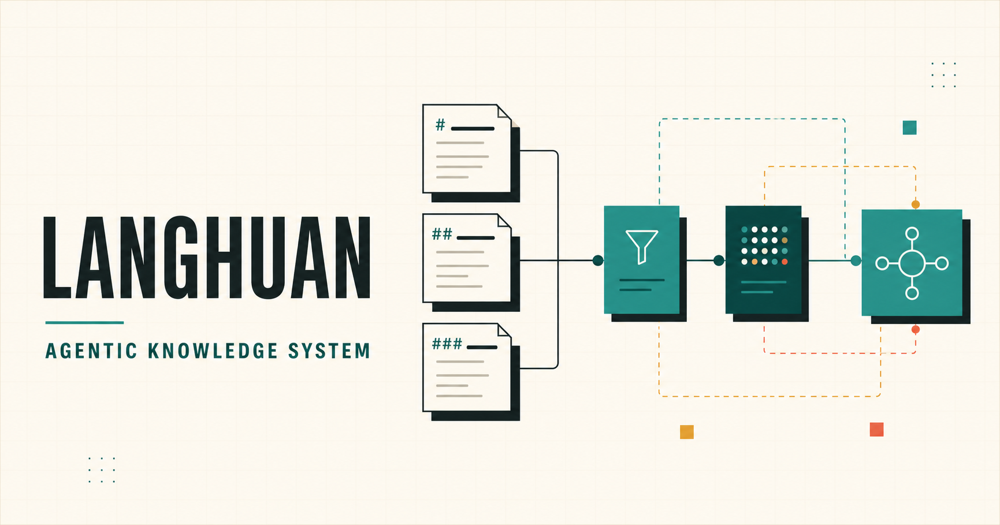
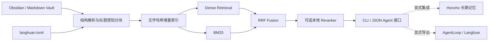

# Langhuan（琅嬛）

**面向 Obsidian / Markdown 项目的本地优先 Agent 知识基础设施。**

Langhuan 把结构化笔记转成可增量维护、可限定项目范围、可供不同 Agent 调用的检索上下文。核心 RAG 不依赖云服务；长期记忆与可观测平台是可选边界，而不是运行前提。



[打开交互式项目总览](https://farprt.github.io/langhuan-agentic-knowledge-system/)

> 当前为 `0.1.0-alpha`：核心检索可以运行，公开基准指标仍待在固定数据集上实测。`ask` 返回检索证据，不伪装成完整问答 Agent。

## 已实现

- 解析 frontmatter、`[[wikilink]]`、`![[embed]]` 与 Markdown 标题层级；
- heading-aware chunking，为知识块保留来源与标题上下文；
- 文件 SHA-256 驱动的增量同步、删除检测、原子写入与一致性审计；
- Dense Retrieval、BM25 与 Reciprocal Rank Fusion（RRF）混合召回；
- 零依赖 Hash Embedding 离线演示，以及显式加载本地 BGE / Cross-Encoder 的接口；
- 通过 `scope` 将检索限制在阅读、项目或用户自定义路径；
- 默认仅写本地 JSONL 元数据，查询正文与摘要采集关闭。

## 架构


```mermaid
flowchart LR
    V["Obsidian / Markdown Vault"] --> P["结构解析与标题感知分块"]
    C["langhuan.toml"] --> P
    P --> I["文件哈希增量索引"]
    I --> D["Dense Retrieval"]
    I --> B["BM25"]
    D --> R["RRF Fusion"]
    B --> R
    R --> X["可选本地 Reranker"]
    X --> A["CLI / JSON Agent 接口"]
    A -.显式集成.-> H["Honcho 长期记忆"]
    A -.显式导出.-> O["AgentLoop / Langfuse"]
```

核心只负责“把相关、可追溯的证据交给 Agent”。Agent 决策、长期记忆与 Trace 分属不同生命周期，避免一个不可用的外部服务拖垮本地检索。

## 五分钟上手

要求 Python 3.11 或更高版本。

```powershell
py -3.11 -m venv .venv
.\.venv\Scripts\Activate.ps1
python -m pip install -e .

# 不读取用户文件、不联网的自检
langhuan demo

# 接入自己的 Obsidian / Markdown 库
langhuan init --vault "D:\Notes\MyVault"
langhuan doctor
langhuan index
langhuan ask "这个知识库如何组织项目文档？"
```

增量更新与机器可读输出：

```powershell
langhuan sync
langhuan ask "RAG 的隐私边界是什么？" --scope projects --json
```

也可以直接体验仓库内的公开演示库：

```powershell
Copy-Item langhuan.toml.example langhuan.toml
langhuan index
langhuan ask "什么比一条固定 prompt 更值得沉淀？"
```

## 单一配置接口

`langhuan init` 生成不进入 Git 的 `langhuan.toml`。最常调整的是目录边界和项目 scope：

```toml
[vault]
path = "D:/Notes/MyVault"
include = ["Sources", "Concepts", "Projects", "Maps", "Areas", "Home"] # 或 ["."]
exclude = [".git", ".obsidian", ".langhuan", "Assets", "Inbox/Processing"]

[retrieval]
embedding_model = "hash"
reranker_model = ""

[scopes.job_hunting]
paths = ["Projects/Job Hunting", "Sources/Workbooks"]

[observability]
enabled = true
include_content = false
```

配置文件只负责结构与本地路径。API Key、LicenseKey 等凭据必须从环境变量或操作系统密钥存储传入集成层，不能写入 TOML。

## 使用本地语义模型

默认 `hash` 后端用于完全离线的安装验证和小型知识库。需要 BGE-M3 或 Cross-Encoder 时：

```powershell
python -m pip install -e ".[models]"
```

显式下载模型到本机后，将其**本地目录**写入配置：

```toml
[retrieval]
embedding_model = "D:/models/bge-m3"
reranker_model = "D:/models/bge-reranker-v2-m3"
```

Langhuan 不会隐式访问 Hugging Face。这样可以区分“安装或更新模型”与“日常离线检索”，也能避免一次网络波动改变运行结果。

## 隐私和可恢复性

- `.langhuan/index.json` 包含知识块正文与向量，只能视为原知识库的敏感派生物；
- `events.jsonl` 默认保存事件类型、数量与查询长度，不保存查询正文或可用于关联查询的固定摘要；
- 索引、日志、模型、真实配置和常见凭据格式均由 `.gitignore` 排除；
- 写索引使用临时文件替换，完整写入前不会覆盖上一个可用版本；
- AgentLoop、Langfuse 与 Honcho 都不随核心自动启动或自动上报。

公开仓库发布前仍应运行秘密扫描与大文件检查。完整威胁边界见 [SECURITY.md](SECURITY.md)。

## 可选集成

| 集成 | 职责 | 核心不可用时 |
|---|---|---|
| Honcho | 跨会话稳定结论与用户偏好 | RAG 继续工作，不写长期记忆 |
| AgentLoop / LoongSuite | Agent 与 RAG Trace 分析 | 事件保留本地，不阻塞查询 |
| Langfuse | 可替换的 Trace、Dataset 与评估出口 | 事件保留本地，不阻塞查询 |

仓库只提供去敏后的边界文档和配置约定，绝不重新发布第三方平台源码。见 [`integrations/`](integrations/README.md)。

## 与知识库仓库的关系

- `Obsidian_Notes_Workspace`：公开参考知识库与实施文档；
- `langhuan-agentic-knowledge-system`：可以安装并接入任意相似 Markdown 项目的运行引擎；
- 作者的私有知识库：真实长期生产案例，不作为公开仓库的数据依赖。

公开参考库演示一种组织方式，但 Langhuan 只依赖配置中的目录和 frontmatter 约定，并不绑定作者的私人路径。

## 待实测指标

以下项目不会在没有固定数据集和脚本证据时填写数字：

- Recall@5、MRR、nDCG；
- Dense、BM25、RRF 与 Reranker 的消融结果；
- 首次索引和单文件增量同步耗时；
- p50 / p95 查询延迟与峰值内存；
- 中断恢复及索引一致性测试。

## 开发验证

```powershell
$env:PYTHONPATH = "$PWD\src"
python -m unittest discover -s tests -v
python -m langhuan demo
```

设计决策和首版限制见 [`docs/ARCHITECTURE.md`](docs/ARCHITECTURE.md)。

## 交互展示

[`showcase/`](showcase/README.md) 提供面向首次访问者的交互式 HTML 总览。它只展示当前公开代码可验证的能力，Markdown、tests 和版本历史仍是事实源。

## Agent structural catalog

RAG answers “which passages are relevant”; the catalog answers “what exists, where it
lives, and which collection owns it.” It is dependency-free and never returns Markdown
bodies:

```powershell
langhuan catalog sync
langhuan catalog status --compact
langhuan catalog context --query "History Chapter" --compact
langhuan catalog context --global --compact
langhuan catalog list --all --compact
langhuan catalog envelope --path "Sources/Books/History/Chapter.md" --workflow auto --action update --compact
langhuan catalog find "Agent" --collection concepts
langhuan catalog ensure-id --path "Sources/Books/History/Chapter.md"
langhuan catalog validate
langhuan catalog evaluate --report .langhuan/evaluation.md
langhuan catalog evaluate-agent --cases agent-evaluation-cases.json --submission agent-result.json
```

`envelope`, `find`, `context`, and `validate` refresh the catalog before answering. Output is stable
JSON with relative paths, collection roles, links, backlinks, and bounded matches.
Use `--compact` on any `catalog` subcommand when its output is injected into an
agent prompt; it removes display indentation without changing the data contract.
For a known target, `envelope` is the normal Agent entrypoint. It deterministically
selects `process-input`, `update-note`, or `update-project`, adds processor-specific
content checks, and returns a metadata-only contract normally bounded to 2000 compact
JSON characters. `context --query` is lexical-only candidate discovery: it never claims
semantic search or completeness, and a miss returns a small `no_match` response with a
RAG next step instead of the Registry. `context --global` explicitly returns the full
Collection Registry, while `catalog list --all` explicitly returns every cataloged
relative path. `find` reports `total` and `truncated`; the contracts expose a separate
`catalog_revision`, `content_digest`, and `reading_ledger_revision`. They respectively
identify the canonical structural projection, the Markdown content snapshot, and the
exact Ledger byte snapshot. They are independent dependency watermarks, not one global
database revision.
In focused context responses, `registry` and `active_registry` are limited to matched
and related collections. The local
`.langhuan/catalog.json` artifact is derived state and stays out of Git.

Durable notes can use frontmatter IDs shaped as `note_<32 lowercase hex>`.
`identity_paths` controls where IDs are expected. Existing notes migrate gradually:
an ID-less note remains visible as an explicit `legacy-path:` identity, but it must
receive an ID before copy, move, rename, merge, split, or delete. `ensure-id` is
idempotent for a valid existing ID; malformed and duplicate IDs fail validation.
Related collections are routing priorities, never a completeness whitelist.

Collections are configurable and may overlap. The most specific path is primary, while
all matching collections contribute related routes:

```toml
[catalog]
include = ["."]
exclude = [".git", ".obsidian", ".langhuan"]
include_non_markdown = false
identity_paths = ["Sources", "Concepts", "People", "Events", "Time", "Maps", "Areas", "Projects"]
metadata_fields = ["id", "type", "status", "area", "subarea", "source_type", "book", "project"]
# reading_ledger = "System/Indexes/reading-ledger.json"

[catalog.collections.history_sources]
paths = ["Sources/Books/History"]
role = "Curated historical reading."
usage = "Check concepts, events, people and time before creating nodes."
workflow = "update-note"
processor = "history-source"
related = ["concepts", "events", "people", "time"]
```

Collections declare lifecycle routing, while processors add mandatory content-discovery
checks. They do not form a completeness whitelist: agents still extract candidates from
the actual note and use exact Catalog lookup or semantic RAG across domains.

Set `include_non_markdown = true` only when agents need an inventory of assets or code.
Those files contribute path, extension, size, and modification time only: Langhuan does
not read their contents or compute content hashes.

An optional reading ledger connects raw, draft, and official notes without guessing from
filenames:

```json
{
  "schema_version": "reading-ledger/v1",
  "sources": {
    "book:id": {
      "kind": "book",
      "title": "Book",
      "canonical_key": "id",
      "inbox_roots": ["Inbox/Books/WeRead/Book"],
      "official_root": "Sources/Books/Book"
    }
  },
  "units": {
    "book:id/ch01": {
      "source_id": "book:id",
      "kind": "book-section",
      "scope": {"label": "Chapter 1"},
      "inputs": [{
        "role": "raw",
        "path": "Inbox/Books/WeRead/Book/raw 01.md",
        "sha256": "0000000000000000000000000000000000000000000000000000000000000000",
        "presence": "present"
      }],
      "outputs": [{"role": "official", "path": "Sources/Books/Book/01 Chapter.md"}],
      "processing_status": "integrated",
      "cleanup_status": "ready-for-cleanup",
      "provenance": {"basis": ["explicit mapping"], "confidence": "reviewed"},
      "issues": []
    }
  }
}
```

Inputs use `presence = present|removed|unknown` and may include SHA-256. `catalog
envelope --path ...` returns the target's matching units and required lifecycle checks;
`catalog validate` checks source references,
paths, hashes, and the versioned processing and cleanup statuses.
`catalog evaluate` derives body-free regression checks from the current stable IDs,
unique titles/aliases, explicit links, Ledger contract, and deterministic Task
Envelopes. The Markdown scorecard separates blocking mechanism failures from quality
gaps such as unresolved or ambiguous known relations; `--strict` makes quality gaps
fail the command. It does not claim to evaluate implicit semantic completeness.
`catalog evaluate-agent` complements it with a small explicit case file and one or more
evidence-only Agent submissions. Cases declare deterministic Envelope/lookup/context
expectations plus `must_find`, `allowed_adopt`, and `must_not_adopt` relations. The
scorer checks target safety, recall, opened-source evidence, forbidden relations, and
cross-Agent agreement without asking an LLM to grade its own answer. Submission and
case files contain paths and decisions, not note bodies.
An official output may additionally use `extensions.note_id`; ID is resolved first,
while `path` remains a readable locator. An ID/path mismatch is an error, while a stale
path with a uniquely resolved ID is a repairable warning.
Legacy `"version": 1` ledgers with array units remain readable with a migration warning.

The RAG index has its own `rag_input_digest`, covering the exact include/exclude
boundary, source paths and hashes, parser/chunker/tokenizer versions, chunk parameters,
and local embedding-model identity. `storage_consistent` only checks index-internal
identity; `fresh` compares indexed and current inputs; `ready` requires both plus the
current pipeline fingerprint. A legacy index therefore cannot silently claim readiness.

## License

原创代码使用 [Apache License 2.0](LICENSE)。第三方软件与模型不随本仓库重新分发，分别遵循其上游许可证，详见 [THIRD_PARTY_NOTICES.md](THIRD_PARTY_NOTICES.md)。
